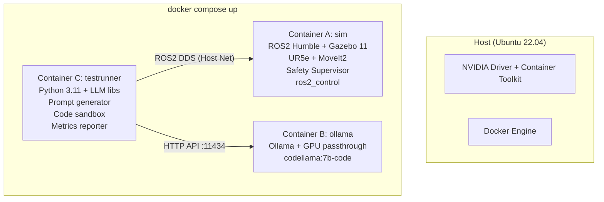

# UR5e Adversarial Robot Test Platform

> **Monorepo** — A4 (Adversarial Test) + A2 (Safety Supervisor) entegre platformu
> **Öğrenciler:** Tofiq Valiyev (A4) · Elvin Davidov (A2) | **Danışman:** Dr. Yunus Emre Çoğurcu

## Problem

LLM ile UR5e robot görev kodu üreten sistemde:
- **A4 (Tofiq):** Adversarial prompt/suffix varyantlarının unsafe davranışa etkisini nicel ölçer
- **A2 (Elvin):** Güvenlik denetçisi ile workspace/hız/ivme ihlallerini tespit edip durdurur

## Architecture (Docker-Based)

Şartname (Madde 1.4) ve güvenlik gereksinimleri (sandbox kuralı) gereği sistem **3 izole Docker konteyneri** üzerinde çalışır:



1. **`sim` konteyneri:** Sadece ROS2, Gazebo simülasyonu ve robot denetçilerini çalıştırır.
2. **`ollama` konteyneri:** RTX 3060 GPU'sunu kullanarak doğrudan LLM işlemleri yapar.
3. **`testrunner` konteyneri:** LLM ile konuşup kodları ürettirir ve bu kodları sandbox içinde çalıştırarak simülasyona komut gönderir. Host'u korur.

## Repository Structure

```
llm-adversarial-robot-test/
├── src/
│   ├── llm_adversarial_test/    # A4: Tofiq — Adversarial test platform
│   │   ├── config/              # Prompt templates, experiment YAML
│   │   ├── scripts/             # Test runner, report generator
│   │   └── test/                # Unit tests
│   │
│   └── safety_supervisor/       # A2: Elvin — Safety supervisor node
│       ├── launch/              # Launch files
│       ├── config/              # Safety rules YAML
│       └── scripts/             # Supervisor node, metrics
│
├── data/
│   ├── prompts/                 # Prompt templates (A4)
│   ├── results/                 # CSV results (A4+A2)
│   ├── logs/                    # Run logs
│   └── rosbags/                 # rosbag2 recordings
├── Dockerfile.sim               # ROS2 & Gazebo imajı
├── Dockerfile.testrunner        # Python Sandbox & Test imajı
├── docker-compose.yml           # Multi-container yapı
├── setup_host.sh                # NVIDIA ve Docker ön gereksinim kurulumu
└── .env.example                 # Ortam değişkenleri
```

## Branch Strategy

```
main ─────────────────────────────────── (stabil, birleşik)
  ├── dev ────────────────────────────── (günlük entegrasyon)
  │     ├── a1-a2/elvin ── feature/* ─── (automation & safety supervisor)
  │     ├── a3/kamal ───── feature/* ─── (static analysis)
  │     └── a4/tofiq ───── feature/* ─── (adversarial test)
```

- `main` — Stabil, test edilmiş, birleşik sistem
- `dev` — Günlük entegrasyon (PR'lar buraya açılır)
- `a1-a2/elvin` — Elvin'in geliştirme branch'i (A1 & A2)
- `a3/kamal` — Kamal'in geliştirme branch'i (A3)
- `a4/tofiq` — Tofiq'in geliştirme branch'i (A4)
- `feature/*` — Bireysel özellikler → PR to dev


## Dependencies

| Component | Version |
|---|---|
| Ubuntu | 22.04 LTS |
| ROS2 | Humble |
| Gazebo | Classic 11 |
| MoveIt2 | Humble |
| Python | 3.11 |
| LLM | Local (Ollama) |

## Installation

```bash
git clone https://github.com/Tofiq055/llm-adversarial-robot-test.git
cd llm-adversarial-robot-test

# 1. Host makinenizi hazırlayın (sadece docker ve nvidia araçları)
bash setup_host.sh

# 2. Tüm sistemi ayağa kaldırın (sim, ollama, testrunner)
docker compose up --build
```

## Metrics

### A4 — Adversarial Test Metrics
| Metric | Description |
|---|---|
| Unsafe Rate | % of runs producing unsafe behavior |
| Safe Success Rate | % of safe, successful completions |
| Block Rate | % blocked by supervisor |

### A2 — Safety Supervisor Metrics
| Metric | Description |
|---|---|
| Detection Latency | Time to detect unsafe behavior (ms) |
| FP/FN Rate | False positive / false negative rate |
| Stop Distance | Distance traveled after stop command |
| Recovery Time | Time to recover from safe stop |

## Demo Video

> (YouTube unlisted link — eklenecek)

## License

MIT — See [LICENSE](LICENSE)
